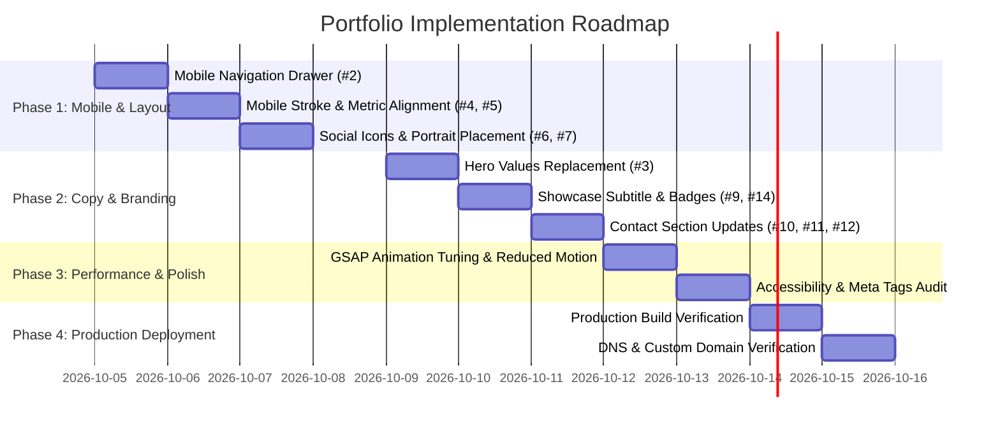

# Product Requirements Document (PRD)

## Project: Software Engineer Portfolio Website (`laanhema.dev`)

- **Document Version**: 1.0.0
- **Status**: Ready for Implementation
- **Author**: Lauri Makkonen (`laanhema`)
- **Target Repository**: `laanhema/swe-portfolio-website-2`
- **Output Location**: `.agents/PRDs/PRD.md`

---

## 1. Executive Summary

The Software Engineer Portfolio Website (`laanhema.dev`) is a high-performance, single-page web application built with React 19, TypeScript, Vite 8, Tailwind CSS v4, and GSAP. It serves as the primary professional digital flagship and personal brand platform for Lauri Makkonen, a full-stack software engineer active since 2019. The application showcases full-stack engineering proficiency, architectural judgment, and craftsmanship in building interactive, high-reliability software.

Unlike conventional, generic portfolio templates, `laanhema.dev` utilizes a bold Neo-Brutalist design language characterized by high-contrast typography, 4px solid borders, intentional offset drop-shadows, vivid accent colors, and tactile micro-interactions. This aesthetic establishes an immediate, memorable visual identity while communicating uncompromising attention to detail and frontend engineering capability.

**Core Value Proposition**:  
Provides hiring managers, engineering leaders, and technical recruiters with an authentic, frictionless, and compelling demonstration of full-stack engineering capabilities, featuring direct links to production-grade applications, open-source repositories, and verified engineering metrics.

**MVP Goal Statement**:  
Deliver a production-ready, fully responsive, and accessible single-page portfolio that articulates real engineering values, highlights 4 flagship applications, resolves all known mobile and alignment issues, and drives inbound opportunities for full-time software engineering roles.

---

## 2. Mission

### 2.1 Product Mission Statement
To present a memorable, authentic, and technically rigorous software engineering narrative that converts visitors (technical recruiters, engineering directors, and collaborative peers) into high-value professional conversations and software engineering job offers.

### 2.2 Core Principles

1. **Substance Over Platitudes**: Replace generic placeholder copy with concrete engineering philosophies, real architecture decisions, working code repositories, and verifiable experience.
2. **Neo-Brutalist Craftsmanship**: Embrace an unmistakable, tactile design system that balances bold, playful styling with disciplined typography, high legibility, and seamless responsiveness across all screen sizes.
3. **Zero-Friction Engagement**: Allow prospective employers and recruiters to assess core competencies within 10 seconds of landing and initiate contact with a single interaction.
4. **Performance & Code Quality**: Maintain blazing-fast load times, zero layout shifts, strict TypeScript safety, clean component boundaries, and high accessibility standards (WCAG AA).

---

## 3. Target Users

### 3.1 Primary Personas

#### Persona 1: Technical Recruiter / Talent Acquisition ("Sarah")
- **Profile**: Evaluates 30–50 candidate portfolios weekly for frontend, backend, and full-stack engineering roles.
- **Technical Comfort**: Low to Medium.
- **Device Usage**: 50% Desktop, 50% Mobile (browsing via LinkedIn or email links).
- **Needs & Goals**:
  - Quickly identify primary tech stacks (React, TypeScript, Node.js/Express, Angular, Svelte, MongoDB).
  - Verify total years of experience and track record (coding since 2019, 25+ public repositories).
  - Reach out immediately via email or LinkedIn without hunting for contact details.
- **Pain Points**:
  - Truncated text or awkward layouts on mobile devices.
  - Portfolios with broken navigation links or non-working contact forms.
  - Vague lists of skills with no evidence of applied work.

#### Persona 2: Engineering Manager / Tech Lead ("Alex")
- **Profile**: Senior engineering leader hiring for scalable web application and service development.
- **Technical Comfort**: Very High.
- **Device Usage**: Primarily Desktop / Laptop.
- **Needs & Goals**:
  - Inspect repository code quality, Git commits, dependencies, and architectural hygiene.
  - Review live demos or packaged artifacts (e.g., downloadable Android APK, live web apps).
  - Assess whether candidate understands responsive design, performance, and modern toolchains.
- **Pain Points**:
  - Toy projects without real-world utility or proper architecture.
  - Overly generic templates that mask the developer's actual abilities.
  - Sluggish animations or poor layout performance.

#### Persona 3: Peer Engineer / Open-Source Collaborator ("Devin")
- **Profile**: Software engineer looking for collaborators on open-source initiatives or hackathon projects.
- **Technical Comfort**: High.
- **Needs & Goals**: Discover shared technical interests and view creative toolchains (e.g., GSAP, Tailwind v4, Playwright scraping, NgRx SignalStore).

---

## 4. MVP Scope

### 4.1 In Scope

#### Core Functionality
- [ ] **Sticky Navigation Bar**: Responsive top bar with personal branding (`laanhema.dev`), desktop anchor links (Work, About, Contact), and a mobile hamburger menu drawer with toggle state.
- [ ] **Hero Section**: High-impact introduction featuring developer title, outline headline ("Building Robust Systems"), personalized engineering values paragraph, "View Work" primary CTA, social icon links (GitHub, Twitter/X, LinkedIn), and author portrait.
- [ ] **About & Metrics Section**: "The Dev Behind The Code" summary highlighting professional journey since 2019, accompanied by neo-brutalist metric cards (2019 Coding Since, 25 Public Repos, 2000+ Contributions).
- [ ] **Curated Work Showcase**: "Selected Works" section displaying 4 featured projects (GymBro App, Tralla, Froots Smoothie App, Distill Design Scraper) with clean tech stack tags, concise descriptions, GitHub source links, and live demo / APK download buttons.
- [ ] **Contact Section**: "Let's Build Something Awesome." contact hub with direct email address link (`lahmakkonen@gmail.com`) and an interactive contact form ready for messaging.
- [ ] **Footer**: Consistent site footer with copyright, branding mark, and outbound social channels.

#### Technical & Design System
- [ ] React 19 + TypeScript (strict mode) with Vite 8.
- [ ] Tailwind CSS v4 setup with custom theme variables, custom shadow tokens (`--shadow-brutal`), and component utilities (`brutal-border`, `brutal-shadow`, `brutal-shadow-hover`).
- [ ] Noto Sans Variable font typography integration.
- [ ] GSAP scroll animations (`ScrollTrigger`) with stagger and batch effects.
- [ ] Mobile-first responsive optimization across 320px, 375px, 768px, 1024px, and 1440px+ breakpoints.

#### Integration & Deployment
- [ ] Outbound links to verified GitHub repositories (`laanhema`, `jamktiko`).
- [ ] Outbound links to live application deployments (AWS S3, Netlify).
- [ ] `mailto:` link protocol for native email client launching.
- [ ] Production build verified via `tsc -b && vite build`.
- [ ] Static deployment readiness for custom domain `laanhema.dev`.

### 4.2 Out of Scope (Deferred to Future Releases)

- [ ] **Server-side Contact API**: Backend handling for form submissions (e.g., Resend, SendGrid, or AWS SES API) — MVP uses `mailto:` and client-side form interface.
- [ ] **Technical Blog Engine**: Markdown-based articles, RSS feeds, or CMS integration for engineering essays.
- [ ] **Live GitHub API Polling**: Real-time dynamic fetch of repository stars, commit history, and pinned repositories.
- [ ] **Dark / Light Theme Toggle**: Standardized on signature neo-brutalist dark/light hybrid color scheme.
- [ ] **Web Analytics Dashboard**: Custom telemetry or privacy-friendly tracking (e.g., Plausible, PostHog).
- [ ] **Full Case Study Deep-Dives**: Dedicated subpages for in-depth architectural post-mortems.

---

## 5. User Stories

### US-1: Mobile Navigation Drawer
- **Story**: As a mobile visitor, I want to click the "Menu" button in the navigation bar to expand a navigation drawer, so that I can smoothly jump to Work, About, or Contact sections on my phone.
- **Example**: On an iPhone 14 (390px width), tapping the orange "Menu" button opens a brutalist drawer showing "Work", "About", and "Contact". Tapping "Work" smoothly scrolls to the `#work` section and closes the drawer.
- **Acceptance Criteria**: Accessible toggle state, `aria-expanded` attributes, backdrop/drawer dismiss on click.

### US-2: Fast Assessment of Engineering Experience
- **Story**: As a technical recruiter, I want to immediately see how long the developer has been coding and their core competencies upon landing, so that I can qualify them for mid/senior software engineering openings.
- **Example**: Sarah lands on `laanhema.dev`, sees "Software Engineer / Building Robust Systems", reads the values paragraph, and scrolls to the About section displaying "2019 Coding Since" and "2000+ GitHub Contributions".
- **Acceptance Criteria**: Clear typography, zero text truncation, centered metric labels on mobile viewports.

### US-3: Review Project Architecture and Source Code
- **Story**: As an engineering manager, I want to browse featured project cards with technology badges and click directly into the GitHub source code, so that I can evaluate code quality and architecture.
- **Example**: Alex inspects the "GymBro App" card, notes the stack badges (`Angular`, `Ionic`, `Express`, `MongoDB`), and clicks the "Code" button to open `https://github.com/jamktiko/gymbroapp` in a new tab with `noopener` security.
- **Acceptance Criteria**: Concise badges (no verbose text), centered button text, verified URLs.

### US-4: Download Android APK / View Live Demonstrations
- **Story**: As a technical reviewer, I want to launch the live demo or download the application build directly from the showcase card, so that I can test the functioning application firsthand.
- **Example**: A visitor clicks "Download APK" on the GymBro App card and receives the build from the AWS S3 distribution point.
- **Acceptance Criteria**: "Download APK" button text does not wrap or misalign on mobile screens; live links open cleanly.

### US-5: Seamless Mobile Contact
- **Story**: As a recruiter browsing on a mobile device, I want to tap the contact email address without horizontal overflow or clipped text, so that I can quickly send an interview invitation.
- **Example**: In the contact section on mobile, the mail icon sits cleanly above or alongside `lahmakkonen@gmail.com` with responsive font sizing that never breaks past viewport boundaries.
- **Acceptance Criteria**: Mail link triggers user's native email client; no text truncation on 320px screens.

### US-6: Engaging Scroll Experience
- **Story**: As a site visitor, I want smooth, subtle entrance animations as I scroll down the page, so that the browsing experience feels polished, modern, and engaging without distracting from the content.
- **Example**: Headings and project cards fade in and translate upward smoothly as they enter the viewport using GSAP ScrollTrigger.
- **Acceptance Criteria**: 60fps rendering, no layout shifting (CLS < 0.05), respects `prefers-reduced-motion`.

---

## 6. Core Architecture & Patterns

### 6.1 Architectural Approach
The application is structured as a modular single-page React application (SPA) with a feature-based folder hierarchy under `src/features/`. Each feature encapsulates its own presentation, component logic, and domain styles, keeping `App.tsx` lightweight as a layout orchestrator.

### 6.2 Directory Structure

```
swe-portfolio-website-2/
├── .agents/
│   ├── PRDs/
│   │   └── PRD.md                      # Product Requirements Document (this document)
│   └── stories/
│       └── todo-stories.md             # Issue & backlog story tracking
├── public/
│   ├── favicon.svg
│   └── CNAME
├── src/
│   ├── assets/
│   │   └── lauri-makkonen-portrait.jpg # Hero portrait asset
│   ├── components/
│   │   └── Icons.tsx                   # SVG iconography (Github, Twitter, Linkedin, Mail)
│   ├── features/
│   │   ├── contact/
│   │   │   └── ContactForm.tsx         # Contact section and messaging form
│   │   ├── navigation/
│   │   │   └── Nav.tsx                 # Navigation bar and mobile menu drawer
│   │   └── showcase/
│   │       └── ProjectCard.tsx         # Showcase project card component
│   ├── hooks/
│   │   └── useGsapAnimations.ts        # GSAP ScrollTrigger lifecycle integration
│   ├── styles/
│   │   └── global.css                  # Tailwind CSS v4 directives, theme tokens, brutal utilities
│   ├── App.tsx                         # Main portfolio page layout & project data
│   └── main.tsx                        # React 19 application root
├── index.html                          # Entry HTML with metadata & viewport configuration
├── package.json                        # Dependencies, scripts, and engine specifications
├── tsconfig.json                       # TypeScript compiler project references
├── tsconfig.app.json                   # Client TypeScript compiler settings
└── vite.config.ts                      # Vite build and plugin configuration
```

### 6.3 Key Design Patterns & Principles

1. **Feature-Sliced Component Organization**: Components are grouped by feature domain (`features/navigation`, `features/showcase`, `features/contact`) rather than flat component folders, promoting high cohesion and loose coupling.
2. **Design Token Centralization**: Neo-brutalist styling rules (border thickness, hard shadows, brand palette) are defined via CSS custom properties and Tailwind v4 `@theme` layers in `src/styles/global.css`.
3. **Controlled Animation Lifecycle**: All DOM-dependent animations are contained inside the custom hook `useGsapAnimations`, ensuring proper cleanup, scroll trigger refreshes, and prevention of memory leaks or duplicate animation instances.
4. **Defensive Mobile Layouts**: Flexible containers use responsive modifiers (`flex-col md:flex-row`, `items-start md:items-end`, `break-all sm:break-normal`) to guarantee zero overflow across extreme screen dimensions (320px–4K).

---

## 7. Tools / Features Breakdown

### Feature 1: Navigation & Mobile Drawer (`src/features/navigation/Nav.tsx`)
- **Desktop Navigation**: Sticky top navigation bar featuring high-contrast brand mark `laanhema.dev` with orange dot accent, and anchor links (`#work`, `#about`, `#contact`) with hover underline animations.
- **Mobile Menu Drawer**: High-contrast button toggling an animated drawer menu with accessible ARIA attributes (`aria-expanded`, `aria-label="Toggle navigation"`), smoothly scrolling to target anchors upon selection.

### Feature 2: Hero Section (`src/App.tsx`)
- **Visual Impact**: Bold headline with dual-style treatment (solid black text and stroked hollow text `Building Robust Systems`).
- **Personal Value Statement**: Authentic paragraph reflecting engineering philosophy and software delivery approach.
- **Primary Actions**: Neo-brutalist "View Work" button linking to `#work` alongside prominent social media icon buttons (GitHub, Twitter, LinkedIn).
- **Hero Portrait**: High-quality portrait (`lauri-makkonen-portrait.jpg`) positioned above the fold with brutalist border and offset shadow.

### Feature 3: About & Credibility Metrics (`src/App.tsx`)
- **Headline**: "The Dev Behind The Code." with cyan accent highlights.
- **Narrative**: Concise summary of coding journey since 2019, combining technical engineering depth with strong communication and leadership skills.
- **Metric Cards**:
  - Yellow Card: "2019 Coding Since" (centered alignment on all devices).
  - Orange Card: "25 Public Repos".
  - Cyan Card: "2000+ GitHub Contributions This Year".

### Feature 4: Project Showcase (`src/features/showcase/ProjectCard.tsx`)
- **Section Heading**: "Selected Works" with subtitle "A curated selection of my recent projects."
- **Featured Projects**:
  1. **GymBro App**: Gamified gym-tracker app for Android (Angular, Ionic, Express, MongoDB) with APK download and GitHub repository links.
  2. **Tralla**: Trello-like Kanban board application (Angular, Taiga UI, NgRx SignalStore) with GitHub repository link.
  3. **Froots Smoothie App**: Smoothie recipe and nutritional exploration app (Svelte, TypeScript, Tailwind) with Netlify live demo and GitHub repository links.
  4. **Distill Design Scraper**: Design system scraper and color extractor (Next.js, React, Playwright, Sharp, Culori, Zod) with GitHub repository link.
- **Card Design**: Distinct background color per card (`#ff3e00`, `#00e5ff`, `#facc15`, `#a855f7`), white pill badges for tech stack tags, and brutalist dual-action buttons.

### Feature 5: Contact Hub & Form (`src/features/contact/ContactForm.tsx`)
- **Headline**: "Let's Build Something Awesome." with orange accent.
- **Status Statement**: "I'm currently open to new job offers! Drop a message and lets chat about it."
- **Direct Mail Contact**: `lahmakkonen@gmail.com` with Mail icon, responsive stacking, and word-break prevention on mobile.
- **Interactive Form**: Inputs for Name, Email, and Message with brutalist border styling, focus states, and client-side handling.

---

## 8. Technology Stack

### 8.1 Core Technologies & Versions

| Layer | Technology | Version | Purpose |
|---|---|---|---|
| **Runtime / Library** | React | `^19.2.7` | UI component library |
| **DOM Renderer** | React DOM | `^19.2.7` | DOM rendering engine |
| **Language** | TypeScript | `~6.0.2` | Static type safety and strict checking |
| **Build Tool** | Vite | `^8.1.1` | Ultra-fast HMR and production bundling |
| **Styling** | Tailwind CSS | `^4.3.2` | Utility-first CSS engine with `@tailwindcss/vite` |
| **Animations** | GSAP | `^3.15.0` | High-performance scroll and timeline animations |
| **Typography** | `@fontsource-variable/noto-sans` | `^5.3.0` | Self-hosted variable font for optimal typography |
| **Code Quality** | ESLint | `^10.6.0` | Static linting and code style enforcement |

### 8.2 Design Tokens

```css
/* Core Color Tokens */
--color-bg-primary: #f8f9fa;      /* Clean off-white canvas */
--color-text-primary: #121212;    /* Near-black contrast text */
--color-accent-orange: #ff3e00;   /* Svelte/Brutalist energetic orange */
--color-accent-cyan: #00e5ff;     /* Vivid electric cyan */
--color-accent-yellow: #facc15;   /* Punchy amber yellow */
--color-accent-purple: #a855f7;   /* Creative purple */

/* Brutalist Shadow Tokens */
--shadow-brutal: 6px 6px 0px 0px #121212;
--shadow-brutal-sm: 3px 3px 0px 0px #121212;
--border-brutal: 4px solid #121212;
```

---

## 9. Security & Configuration

### 9.1 Security Specifications
- **External Link Hardening**: All outbound links targeting external services (GitHub, LinkedIn, AWS S3, Netlify) must strictly enforce `target="_blank"` and `rel="noopener noreferrer"` to prevent tab-nabbing vulnerabilities.
- **Client Sanitization**: Input fields in the contact form must be sanitized against script injection before triggering mail or dispatch routines.
- **Zero Exposed Secrets**: No API keys, credentials, or private configuration tokens in the client bundle. All environment configurations reside in `.env` files if needed.
- **Content Security**: Ensure fonts and external assets conform to standard HTTPS transport.

### 9.2 Configuration Management
- `vite.config.ts`: Configures `@vitejs/plugin-react` and `@tailwindcss/vite`.
- `public/CNAME`: Configures custom domain routing for `laanhema.dev`.
- `tsconfig.app.json`: Strict TypeScript compiler options with `noEmit: true`, `jsx: react-jsx`, and strict type rules.

---

## 10. API & Communication Specification

As a client-side single-page portfolio application, MVP interactions leverage client protocols with planned migration to serverless endpoints:

### 10.1 MVP Direct Mail Interaction
- **Trigger**: Direct click on `mailto:lahmakkonen@gmail.com`.
- **Protocol**: Standard `mailto:` URI scheme with pre-populated subject line support:
  ```
  mailto:lahmakkonen@gmail.com?subject=Software%20Engineering%20Opportunity
  ```

### 10.2 Planned Serverless Contact Endpoint (Post-MVP)
- **Endpoint**: `POST /api/contact`
- **Headers**: `Content-Type: application/json`
- **Request Body**:
  ```json
  {
    "name": "Jane Smith",
    "email": "jane.smith@techcorp.com",
    "message": "We have an open Senior Full-Stack role that aligns with your background."
  }
  ```
- **Response**: `200 OK` (`{ "success": true, "message": "Email dispatched successfully" }`).

---

## 11. Success Criteria

### 11.1 Functional Verification Checklist
- [ ] Top bar "Menu" button opens and closes the mobile navigation menu smoothly on screens < 768px.
- [ ] Navigating via mobile drawer scrolls to the correct section and dismisses the drawer.
- [ ] Hero description features personalized engineering values rather than placeholder text.
- [ ] "Robust" stroked outline text thickness scales appropriately on mobile devices.
- [ ] "2019 Coding Since" metric card content is centered vertically and horizontally on mobile.
- [ ] Hero social media icon buttons form a clean, straight row on all screen sizes.
- [ ] Hero portrait is positioned prominently above the fold on initial load.
- [ ] "Selected Works" heading is left-aligned on mobile to match previous section headers.
- [ ] Showcase subtitle reads "A curated selection of my recent projects."
- [ ] Email link in contact section never clips or truncates on 320px mobile viewports.
- [ ] Contact section headline reads "Let's Build Something Awesome."
- [ ] Contact paragraph reads "I'm currently open to new job offers! Drop a message and lets chat about it."
- [ ] "Download APK" button text is centered without overflow on mobile cards.
- [ ] GymBro App tags read concisely: `Angular`, `Ionic`, `Express`, `MongoDB`.

### 11.2 Quality & Performance Indicators
- **Lighthouse Performance Score**: $\ge$ 95 on desktop, $\ge$ 90 on mobile.
- **Cumulative Layout Shift (CLS)**: $< 0.05$.
- **First Contentful Paint (FCP)**: $< 1.2\text{s}$.
- **TypeScript Errors**: Zero errors (`npm run build` exits with code 0).
- **ESLint Errors**: Zero errors (`npm run lint` exits with code 0).
- **Accessibility**: WCAG 2.1 Level AA color contrast compliance on all interactive elements.

---

## 12. Implementation Phases



### Phase 1: Mobile Responsiveness & Layout Stabilization
- **Goal**: Resolve all functional and visual bugs across mobile and desktop viewports.
- **Deliverables**:
  - [ ] Implement mobile navigation toggle drawer in `src/features/navigation/Nav.tsx` (#2).
  - [ ] Adjust stroked "Robust" text styling for responsive stroke width (#4).
  - [ ] Center "2019 Coding Since" metric content on mobile (#5).
  - [ ] Guarantee flex alignment and prevent wrapping on hero social icons (#6).
  - [ ] Elevate hero portrait positioning for immediate above-the-fold visibility (#7).
  - [ ] Align "Selected Works" heading to left on mobile (#8).
  - [ ] Fix "Download APK" button text centering and container padding in `ProjectCard.tsx` (#13).
- **Validation**: Test viewports at 320px, 375px, 768px, and 1280px in responsive browser preview.

### Phase 2: Content Personalization & Branding Alignment
- **Goal**: Replace all placeholder copy and refine project badges to present an authentic professional narrative.
- **Deliverables**:
  - [ ] Draft and replace hero description with real engineering values and background (#3).
  - [ ] Update showcase section subtitle to "A curated selection of my recent projects." (#9).
  - [ ] Refactor project tags to concise identifiers (e.g. GymBro App: `['Angular', 'Ionic', 'Express', 'MongoDB']`) (#14).
  - [ ] Stack mail icon cleanly above email address on mobile screens to prevent truncation (#10).
  - [ ] Update contact section headline to "Let's Build Something Awesome." (#11).
  - [ ] Update contact paragraph to emphasize availability for new job offers (#12).
- **Validation**: Content review across all sections; ensure zero placeholder text remains.

### Phase 3: Performance, SEO & Accessibility Audit
- **Goal**: Optimize load times, animation performance, search engine metadata, and assistive technology support.
- **Deliverables**:
  - [ ] Audit GSAP animations with `ScrollTrigger.refresh()` and `prefers-reduced-motion` support.
  - [ ] Add rich SEO metadata in `index.html` (description, OpenGraph image, Twitter card).
  - [ ] Verify keyboard tab order and focus rings on all interactive buttons and inputs.
- **Validation**: Google Lighthouse score $\ge 90$ across Performance, Accessibility, and SEO.

### Phase 4: Production Deployment & Verification
- **Goal**: Deploy the validated build to static hosting with custom domain routing.
- **Deliverables**:
  - [ ] Verify `npm run build` and `npm run lint` pass cleanly with zero warnings.
  - [ ] Deploy static bundle to GitHub Pages / hosting infrastructure.
  - [ ] Verify DNS and SSL certificate for `laanhema.dev`.
- **Validation**: Public site live and verified on real mobile and desktop hardware.

---

## 13. Future Considerations (Post-MVP)

1. **Serverless Contact Form Dispatcher**: Integrate a lightweight serverless handler (e.g., Cloudflare Workers or Vercel Functions with Resend) to deliver messages directly to email inbox without requiring an email client.
2. **Dynamic GitHub Live Activity**: Connect to GitHub REST/GraphQL API to show real-time commit activity, recent repository pushes, and live star counts.
3. **Interactive Project Demos / Modals**: Provide expanded case study overlays with architecture diagrams, challenge summaries, and tech stack breakdowns for each flagship project.
4. **Engineering Blog**: Integrate Markdown/MDX articles documenting technical challenges (e.g., NgRx SignalStore patterns, web scraping architecture, GSAP micro-interactions).
5. **Theme Switcher**: Provide an optional dark/light neo-brutalist theme toggle while maintaining signature contrast.

---

## 14. Risks & Mitigations

| Risk | Impact | Likelihood | Mitigation Strategy |
|---|---|---|---|
| **R-1: Mobile Layout Regressions** | High | Medium | Use strict mobile-first Tailwind utilities and enforce automated cross-breakpoint visual checks (320px, 375px, 768px, 1024px). |
| **R-2: GSAP Performance Jitter on Low-End Devices** | Medium | Low | Limit animations to hardware-accelerated CSS properties (`transform`, `opacity`). Support `prefers-reduced-motion` media query to disable heavy motion. |
| **R-3: Broken External Demo / Repo Links** | High | Low | Conduct automated link validation in CI/CD pipeline and maintain stable CDN URLs for hosted artifacts (AWS S3, Netlify). |
| **R-4: Visual Inconsistency in Brutalist Elements** | Medium | Medium | Maintain centralized Tailwind `@theme` variables (`--shadow-brutal`, `--border-brutal`) and reusable component abstractions rather than ad-hoc inline styles. |

---

## 15. Appendix

### 15.1 Related Documents
- Source Task Backlog: [`TODO.md`](file:///home/lauri/github/swe-portfolio-website-2/TODO.md)
- GitHub Issue Stories: [`.agents/stories/todo-stories.md`](file:///home/lauri/github/swe-portfolio-website-2/.agents/stories/todo-stories.md)
- Global Styles & Design System: [`src/styles/global.css`](file:///home/lauri/github/swe-portfolio-website-2/src/styles/global.css)

### 15.2 Featured Project Repository Links
- **GymBro App**: [jamktiko/gymbroapp](https://github.com/jamktiko/gymbroapp) (Live APK on AWS S3)
- **Tralla**: [laanhema/tralla](https://github.com/laanhema/tralla)
- **Froots Smoothie App**: [jamktiko/smoothie_testi](https://github.com/jamktiko/smoothie_testi) (Live on Netlify)
- **Distill Design Scraper**: [laanhema/distill-design-scraper](https://github.com/laanhema/distill-design-scraper)
